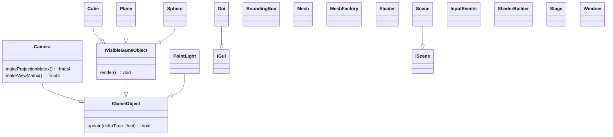

# 3DProject

```mermaid
classDiagram

class Camera {
	makeProjectionMatrix(): fmat4
	makeViewMatrix(): fmat4
}
class Cube
class IGameObject {
	update(deltaTime: float): void
}
class IVisibleGameObject {
	render(): void
}
class Plane
class PointLight
class Sphere

class Gui
class IGui

class BoundingBox
class Mesh
class MeshFactory
class Shader

class IScene
class Scene

class InputEvents
class ShaderBuilder
class Stage
class Window

Camera --|> IGameObject
Cube --|> IVisibleGameObject
IVisibleGameObject --|> IGameObject
Plane --|> IVisibleGameObject
PointLight --|> IGameObject
Sphere --|> IVisibleGameObject

Gui --|> IGui

Scene --|> IScene

```
